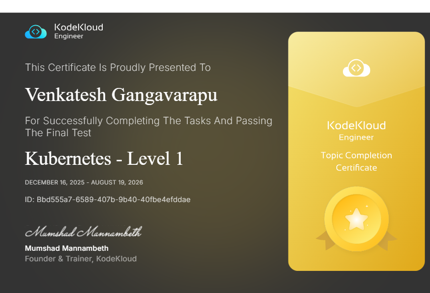

# ☸️ Kubernetes Challenge — KodeKloud

14 days of hands-on Kubernetes tasks on KodeKloud — each fully documented with a README, runnable commands.sh, and a LinkedIn post. Completed with a **10-question certification exam** and **certificate earned** in August 2026.

Every task is documented as it actually happened — failures inline, not hidden.

🔗 **LinkedIn:** [venkatesh-gangavarapu](https://www.linkedin.com/in/venkatesh-gangavarapu)
🔗 **AWS Challenge (Completed ✅):** [100-days-cloud-challenge-AWS](https://github.com/venkatesh-gangavarapu/100-days-cloud-challenge-AWS)
🔗 **Azure Challenge (In Progress 🔄):** [100-Days-Of-Cloud-Challenge-Azure](https://github.com/venkatesh-gangavarapu/100-Days-Of-Cloud-Challenge-Azure)

---

## 🏆 Certificate

| | |
|--|--|
| **Recipient** | Venkatesh Gangavarapu |
| **Issuing Organization** | KodeKloud Engineer |
| **Certificate** | Kubernetes - Level 1 — Topic Completion Certificate |
| **Certificate ID** | `Bbd555a7-6589-407b-9b40-40fbe4efddae` |
| **Period** | December 16, 2025 – August 19, 2026 |
| **Signed by** | Mumshad Mannambeth — Founder & Trainer, KodeKloud |
| **Result** | ✅ Successfully Completed Tasks & Passed The Final Test |

---

## 📅 Daily Log — 14 Tasks Completed

| Day | Topic | Key Learnings | Status |
|-----|-------|---------------|--------|
| [Day 01](./day-01/README.md) | Create a Pod | `kubectl run` can't set container name — use `--dry-run=client -o yaml` + `sed`; labels are selectors | ✅ Done |
| [Day 02](./day-02/README.md) | Create a Deployment | `kubectl create deployment`; Deployment → ReplicaSet → Pod chain; `rollout status` is authoritative | ✅ Done |
| [Day 03](./day-03/README.md) | Namespaces + Pod | `-n` on every command including dry-run; `kubectl get pods -A`; namespace deletion cascades | ✅ Done |
| [Day 04](./day-04/README.md) | Resource Requests & Limits | Requests = scheduler reservation; Limits = runtime enforcement; CPU throttled, memory OOMKilled; Burstable QoS | ✅ Done |
| [Day 05](./day-05/README.md) | Rolling Updates | `kubectl set image` needs container name not deployment name; `rollout status` blocks; old RS kept at 0 for rollback | ✅ Done |
| [Day 06](./day-06/README.md) | Rollback | Inspect `rollout history` before rolling back; revision numbers shift after rollback; `revisionHistoryLimit: 0` removes rollback | ✅ Done |
| [Day 07](./day-07/README.md) | ReplicaSet | No `kubectl create replicaset` — YAML only; labels in 3 locations; no rolling update semantics | ✅ Done |
| [Day 08](./day-08/README.md) | CronJob | CronJob → Job → Pod hierarchy; `restartPolicy: Always` rejected at admission; `batch/v1`; `--from=cronjob/` for manual test | ✅ Done |
| [Day 09](./day-09/README.md) | Job | `kubectl create job` omits `spec.template.metadata.name`; `restartPolicy: Never` = new Pod per retry, logs preserved | ✅ Done |
| [Day 10](./day-10/README.md) | ConfigMap + Env + Volume | Namespace → ConfigMap → Pod creation order; wrong namespace → `CreateContainerConfigError`; shell constructs need `/bin/sh -c`; volume name must match | ✅ Done |
| [Day 11](./day-11/README.md) | Pod Troubleshooting | `httpd:latests` typo → ImagePullBackOff (not the sidecar); read Events before guessing; `kubectl set image` as fast fix without delete | ✅ Done |
| [Day 12](./day-12/README.md) | In-place Modifications | `kubectl patch` JSON for nodePort; `kubectl scale` (no rolling update); `kubectl set image` triggers rolling update; verify all 3 changes | ✅ Done |
| [Day 13](./day-13/README.md) | NodePort Service | Services connect to Pods via labels — not controllers; `kubectl expose` copies selector automatically; `--node-port` flag doesn't exist → patch; empty Endpoints = selector mismatch | ✅ Done |
| [Day 14](./day-14/README.md) | Nginx + PHP-FPM + kubectl cp | **4 confirmed bugs:** `listen 8099→80`; wrong `root` for nginx mount; `SCRIPT_FILENAME $document_root` → php-fpm path; **Service `port`+`targetPort` 8099→80**; subPath = restart required; bare pod = export before delete; test internal AND external | ✅ Done |

---

## 🎓 Certification Exam — 10 Questions

| Q | Topic | Technique Used |
|---|-------|---------------|
| 1 | Create Pod with custom container name | `kubectl run --dry-run -o yaml` + `sed` (4-space indent) |
| 2 | Init containers | YAML only — `spec.initContainers` |
| 3 | Scale a Deployment | `kubectl scale --replicas=3` |
| 4 | Rollback a Deployment | `kubectl rollout undo` |
| 5 | Create a Job with template metadata name | YAML only — `kubectl create job` skips that field |
| 6 | Create a CronJob with custom container name | `kubectl create cronjob --dry-run` + range-restricted `sed` |
| 7 | Fix broken Service — selector typo | `kubectl patch spec.selector` — empty Endpoints caught it |
| 8 | Fix Nginx + PHP-FPM + file copy | ConfigMap + Service patch + `kubectl cp -c nginx-container` |
| 9 | Add label to Service **selector** | `kubectl patch spec.selector` |
| 10 | Add label to Service **metadata** | `kubectl patch metadata.labels` — different from selector |

📄 **Full exam explanations (simple + technical):** [certification/exam-explained.md](./certification/exam-explained.md)

---

## 📦 Topics Covered

| Domain | Days |
|--------|------|
| Pod fundamentals & container naming | Day 01, Exam Q1 |
| Deployments & ReplicaSets | Day 02, Day 07 |
| Namespaces | Day 03, Day 10 |
| Resource Requests, Limits & QoS | Day 04 |
| Rolling Updates | Day 05, Day 12 |
| Rollback & Revision History | Day 06, Exam Q4 |
| CronJob & Job | Day 08, Day 09, Exam Q5, Q6 |
| ConfigMaps, Env Variables & Volumes | Day 10, Day 14 |
| emptyDir & subPath volumes | Day 10, Day 14 |
| Pod Troubleshooting | Day 11, Day 14 |
| Multi-container & Init Containers | Day 11, Exam Q2 |
| Services, NodePort & Endpoints | Day 12, Day 13, Day 14, Exam Q7–Q10 |
| kubectl patch, scale, set image | Day 12, Day 13, Day 14 |
| kubectl cp | Day 14, Exam Q8 |
| Nginx + PHP-FPM pattern | Day 14, Exam Q8 |

---

## 🗂️ Deliverable Structure

Each day produced three files:

| File | Purpose |
|------|---------|
| `README.md` | WHY before HOW — concepts, both methods (imperative + declarative), common mistakes, real-world context, interview Q&A |
| `commands.sh` | Fully runnable with `set -e`, inline comments explaining every step, verification after each action, commented cleanup |
| `linkedin_post.txt` | Senior engineer voice — leads with the sharpest technical insight, never "Today I learned" |

---

## 🔑 The 8 Lessons That Matter Most

1. **`kubectl run` names the container after the pod** — always dry-run + sed when a custom name is required
2. **Some resources have no imperative shortcut** — ReplicaSet, init containers: YAML only
3. **`kubectl set image` needs the container name** — inspect before patching
4. **Read Events before touching anything** — `kubectl describe` first, fix second
5. **Empty Endpoints = selector mismatch** — the most common "pod healthy, website broken" cause
6. **SubPath ConfigMap mount = pod restart required** — `path=` in describe is the signal
7. **Bare pod = no auto-recreate** — export before delete, always
8. **`metadata.labels` ≠ `spec.selector`** — two completely different things on the same object

---

## 🛠️ Lab Environment

- **Platform:** KodeKloud interactive labs
- **Access:** `kubectl` on jump-host (pre-configured kubeconfig)
- **Cluster:** Control plane + worker nodes managed by KodeKloud

---

*Real failures documented inline. Every README reflects what actually happened, not just the happy path.*
